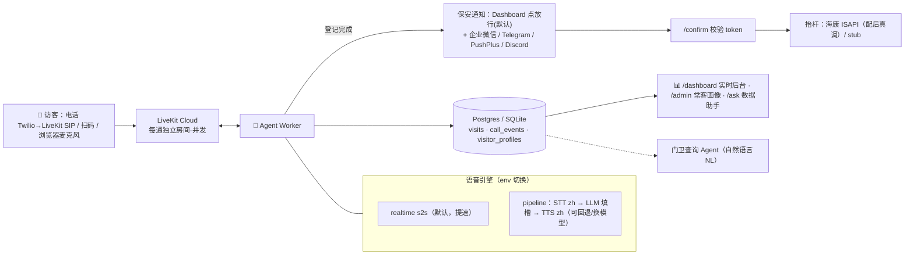

# 📖 详细操作指南（GUIDE）

> README 是一页速览；本页是**自包含的完整操作手册**：跑通、部署、配置、演示、排错。专题深挖另有文档，文中会指出。
>
> 目录：[1 项目概述](#1-项目概述) · [2 技术选型](#2-技术选型一句话版) · [3 在线直接体验](#3-在线直接体验最快) · [4 本地部署](#4-本地部署) · [5 环境变量全表](#5-环境变量全表) · [6 电话接入](#6-电话接入twilio--livekit-sip) · [7 通知渠道](#7-保安通知渠道) · [8 演示数据](#8-演示数据) · [9 测试](#9-测试) · [10 录演示视频](#10-录演示视频) · [11 常见问题与排错](#11-常见问题与排错)

---

## 1. 项目概述

为工业园区做的**语音 AI 访客登记门卫**，替代保安走到车旁人工问询：

```
未登记车辆 → 拨打入口电话 → AI 门卫自然中文对话采集
   车牌 / 来访单位 / 手机号 / 来访事由（入场时间系统自动记）
→ 结构化信息推送保安微信 → 保安点「确认放行」→ 远程抬杆
```

**目标**：从 Agent 开口到微信消息发出 **≤25 秒**；对话像真人门卫一样自然（一句话问全、只补缺项、不机械一问一答）。



---

## 2. 技术选型（一句话版）

| 决策 | 选择 | 为什么 |
|---|---|---|
| 语音框架 | **LiveKit Agents** | 原生 SIP 电话接入 + 打断(barge-in) + 每通独立房间天然并发；自建 WebRTC/媒体太重，Vapi/Retell 黑盒难定制 |
| 语音引擎 | **realtime s2s** 默认，**pipeline** 可回退 | s2s 首句 ≈1.4s 明显更快、更自然；pipeline 有文字、更抗网络抖动、可换任意 LLM/STT/TTS |
| 模型 | 全 **OpenAI** 单 key（STT+LLM+TTS / realtime） | 一个 key 跑通整条线；`providers.py` 里全部 env 可换（Claude / Gemini / Azure / Deepgram / 国内 OpenAI 兼容端点） |
| 通知 | 企业微信群机器人 webhook（已上线） | 国内常用、零审批、无 IP 限制、云端可发；卡片带「确认放行」链接 |
| 部署 | Railway + LiveKit Cloud + Postgres，GitHub 自动部署 | 常驻不休眠、push 即上线、手机随处可测 |

> 完整决策记录（每条**为什么 + 优势 + 根因 + 是否跟模型相关**）见 [ARCHITECTURE_DECISIONS.md](ARCHITECTURE_DECISIONS.md)；框架横评见 [FRAMEWORK_RESEARCH.md](FRAMEWORK_RESEARCH.md)；模型可换架构见 [MODELS.md](MODELS.md)。

---

## 3. 在线直接体验（最快）

整套已常驻部署在云端，**不用本地装任何东西**：

- 📞 **拨打电话**：**+1 586 325 7270**（Twilio → LiveKit Cloud → 云端 worker），接通即和 AI 门卫对话登记。
- 🌐 **后台**：https://web-production-d105c.up.railway.app
  - `/dashboard` 实时后台（看字段/字幕，点「✅放行」）
  - `/ask` 门卫数据助手（自然语言查：本周多少车、谁来得最多…）
  - `/admin` 常客画像
  - 门卫口令 **`demo123`**（`/login` 输入；`/health` 返回 ok）
- 回访测试：车牌 `沪A12345` 或手机 `13800138001` → 识别为常客「张师傅」（演示数据已入库）。

---

## 4. 本地部署

### 4.0 前置

只需一个 **`OPENAI_API_KEY`** 即可跑通整条语音链路（STT+LLM+TTS 全 OpenAI）。电话接入额外需要 LiveKit Cloud + Twilio（见 [§6](#6-电话接入twilio--livekit-sip)）；纯本地浏览器/文本仿真不需要。

### 4.1 Linux / macOS（有 Docker）

```bash
python -m venv .venv && source .venv/bin/activate
pip install -r requirements.txt
cp .env.example .env && mkdir -p data          # 填 OPENAI_API_KEY

# 本地 LiveKit（dev 模式，devkey/secret，无需账号）
docker run -d --name livekit-dev \
  -p 7880:7880 -p 7881:7881 -p 7882:7882/udp \
  livekit/livekit-server --dev

# 两个进程，各开一个终端
./scripts/run_web.sh         # 终端A → :8080
./scripts/run_agent.sh dev   # 终端B → 语音 worker（连 LiveKit、registered）
```

浏览器：访客 http://localhost:8080/voice （点接入、允许麦克风、说话登记）· 后台 http://localhost:8080/dashboard （点「✅放行」）。

> `.env` 里 `LIVEKIT_URL=ws://localhost:7880`、`LIVEKIT_API_KEY=devkey`、`LIVEKIT_API_SECRET=secret`、`DATABASE_URL=sqlite:///./data/visits.db`、`WEB_PORT=8080`。

### 4.2 Windows / ARM64（无 Docker）

Windows on ARM64 有两个真实坑，已知解法（详见 [SMOKE_CHECK.md](SMOKE_CHECK.md) 与 [LOCAL_RUN_ISSUES.md](LOCAL_RUN_ISSUES.md)）：

1. **必须用 x64 Python**：`livekit-blingfire` 无 `win_arm64` wheel。装官方 x64 Python 3.12（用户级即可），用它建 venv；Windows 11 on ARM 自带 x64 模拟能正常加载所有原生扩展。
2. **LiveKit 用原生二进制**：从 https://github.com/livekit/livekit/releases 下对应平台 `livekit-server`，`livekit-server.exe --dev` 等价于 Docker dev。

PowerShell 命令对照：

```powershell
# 0) 用 x64 Python 建 venv（路径换成你的 x64 python.exe）
& "C:\path\to\python312-x64\python.exe" -m venv .venv
.\.venv\Scripts\python.exe -m pip install -r requirements.txt

# 1) 环境变量 + 单测
$env:PYTHONPATH="src"; $env:PYTHONUTF8="1"
.\.venv\Scripts\python.exe -m pytest -q          # 94 passed

# 2) 本地 LiveKit（原生二进制）
C:\path\to\livekit-server.exe --dev              # ws://localhost:7880, devkey/secret

# 3) 两个进程（各开一窗口，均从仓库根目录、x64 venv）
.\.venv\Scripts\python.exe -m visitor_agent.web.server     # 终端A → :8080
.\.venv\Scripts\python.exe -m visitor_agent.agent dev      # 终端B → worker
```

- `Copy-Item .env.example .env` = `cp`；`New-Item -ItemType Directory -Force data` = `mkdir -p data`。
- pip 在 OneDrive 中文路径下可能刷红字日志，但末行 `Successfully installed` 即成功（可 `$env:PIP_NO_COLOR=1` 抑制）。
- dev 模式坑：LiveKit 只对**新建房间**派 job。先开浏览器占住房间再启 worker → AI 不出声；处置：重启 worker 后**刷新/重连浏览器**。

### 4.3 无语音文本仿真（最省事，验对话逻辑）

不用麦克风/电话，跑同一套对话大脑：

```bash
./scripts/run_sim.sh --scenario scenarios/songhuo.json --live
```

更多场景在 `scenarios/`：黑名单 `d_blacklist`、字母车牌消歧 `s2_letters`、改手机号只复述改动项 `s3_changephone`、手机位数校验 `s4_shortphone`、公司不在名单 `s5_unknownco`、参观无接待方 `s7_visit`、单位名单纠正 `roster_test`、面试 `mianshi`。

### 4.4 全云端常驻部署（Railway，push 自动上线）

让整套跑在云上、手机随处测、电脑可关机。要点：手机直连 LiveKit Cloud（实时音频），云主机只开 HTTP；Agent Worker 在容器内常驻、出站连 LiveKit Cloud + OpenAI。

1. Railway → New Project → **Deploy from GitHub repo** → 选本仓库，分支 `main`。检测到 `Dockerfile` 自动构建（容器内同跑 web + agent，见 `scripts/start.sh`）。
2. 加 Postgres 插件，`DATABASE_URL` 用 Railway 变量引用 `${{Postgres.DATABASE_URL}}`（自动同步、干净）。
3. 设环境变量（见 [§5](#5-环境变量全表)）：`OPENAI_API_KEY`、`VOICE_MODE=realtime`、`LIVEKIT_*`(LiveKit Cloud)、`NOTIFY_CHANNEL=wecom`+`WECOM_WEBHOOK_URL`、`GUARD_ACCESS_KEY=demo123` 等。
4. 部署成功拿到域名后，把 `PUBLIC_BASE_URL` 设成该 https 域名并重部署（保安确认链接要用）。
5. 自检：`/health` 返回 ok；日志里 agent worker `registered ... wss://...livekit.cloud`。

> ⚠️ **Windows 设 Railway 密钥别用 `--stdin`**（会被加 UTF-8 BOM 污染值导致 401/解析失败），用参数形式 `railway variable set "KEY=VALUE"`。详见 [DEPLOY.md](DEPLOY.md)（含 Fly.io 版与排坑）。
>
> 运维：`railway logs --service web` 查日志；`railway variable set` 改变量；`railway redeploy --service web --yes` 重部署。

---

## 5. 环境变量全表

`.env` 已 gitignore，密钥永不上传；他人 `clone → cp .env.example .env → 填自己的 key` 即可。完整带注释版见 [.env.example](.env.example)。

| 变量 | 默认 | 说明 |
|---|---|---|
| `OPENAI_API_KEY` | — | **唯一必填**。STT+LLM+TTS / realtime 全用它 |
| `VOICE_MODE` | `realtime` | `realtime`(s2s 提速) / `pipeline`(STT→LLM→TTS 回退) |
| `REALTIME_MODEL` `REALTIME_VOICE` | `gpt-realtime` / `marin` | realtime 模型与音色 |
| `REALTIME_ALLOW_INTERRUPT` | `0` | 0=AI 把话说完不被噪音/回声打断（推荐）；1=允许 barge-in |
| `REALTIME_NOISE_REDUCTION` | `near_field` | 电话/耳麦=near_field；会议=far_field；off=关 |
| `REALTIME_VAD_THRESHOLD` `REALTIME_SILENCE_MS` | `0.8` / `800` | server-VAD 灵敏度 / 判定「说完」的静音时长，越大越不易被打断 |
| `LLM_PROVIDER` `LLM_MODEL` | `openai` / `gpt-4o-mini` | pipeline 时用；可切 `anthropic`/`claude-haiku-4-5`（需 `ANTHROPIC_API_KEY`） |
| `LLM_BASE_URL` | 空 | 指向任一 OpenAI 兼容端点（OpenRouter/DashScope/DeepSeek…）即用任意模型，见 MODELS.md |
| `STT_PROVIDER` `STT_MODEL` `STT_LANGUAGE` | `openai` / `gpt-4o-transcribe` / `zh` | 可切 `deepgram` |
| `TTS_PROVIDER` `TTS_MODEL` `TTS_VOICE` | `openai` / `gpt-4o-mini-tts` / `alloy` | 可切 `azure`（zh-CN 神经音色） |
| `LIVEKIT_URL` `LIVEKIT_API_KEY` `LIVEKIT_API_SECRET` | dev: `ws://localhost:7880`/`devkey`/`secret` | 电话接入需 LiveKit **Cloud**（dev server 公网打不进） |
| `NOTIFY_CHANNEL` | `none` | `none`(后台点放行) / `wecom` / `wecom_app` / `telegram` / `pushplus` / `discord`，逗号可多选 |
| `WECOM_WEBHOOK_URL` | — | 企业微信群机器人 webhook（`wecom`，已上线，无 IP 限制） |
| `TELEGRAM_BOT_TOKEN` `TELEGRAM_CHAT_ID` | — | Telegram（`telegram`，已验证） |
| `PUSHPLUS_TOKEN` | — | PushPlus → 个人微信（`pushplus`，备选） |
| `PUBLIC_BASE_URL` | `http://localhost:8080` | 保安确认链接用；Telegram 要求公网/隧道地址 |
| `DATABASE_URL` | `sqlite:///./data/visits.db` | 生产换 Postgres `postgresql://...`（重启不丢） |
| `SIP_INBOUND_NUMBER` | — | 入园电话号码（E.164），配 `scripts/setup_sip.sh`，见 TELEPHONY.md |
| `GUARD_ACCESS_KEY` | 空 | 设了则 `/dashboard /ask /admin` 及数据 API 需口令（留空=不设防） |
| `GUARD_PHONES` | — | 门卫手机号（逗号分隔）；来电在此名单=转语音数据助手，否则=访客登记 |
| `GUARD_DIAL_NUMBER` `SIP_OUTBOUND_TRUNK_ID` | — | 转人工外呼把门卫接进通话（需 LiveKit 出站 trunk） |
| `HANGUP_SILENCE_SEC` `MAX_CALL_SEC` | `6` / `180` | 登记完静默 N 秒自动挂断 / 单通最长秒数兜底 |
| `ROSTER_PATH` `ROSTER_THRESHOLD` | `roster.demo.json` / `0.55` | 来访单位自动纠正到园区名单（留空=关） |
| `ACCESS_LIST_PATH` `AUTO_PASS_WHITELIST` | `access.demo.json` / `false` | 常客/黑名单（车牌/手机）；true=常客自动放行 |
| `HIKVISION_URL/USER/PASSWORD/CHANNEL` | 空 | 留空=抬杆 stub（打印日志）；配上=真实海康 ISAPI |
| `TENANTS_PATH` | 空 | 指向 tenants.json 即开启多租户（按被叫号路由），见 UPGRADE_PLAN.md |
| `TIMEZONE` `WEB_PORT` | `Asia/Shanghai` / `8080` | 入场时间时区 / web 端口 |

---

## 6. 电话接入（Twilio → LiveKit SIP）

访客拨号进来是核心需求。链路：**电话号码（Twilio/SIP 中继）→ LiveKit Cloud SIP → Agent Worker**。

最短路径：用 LiveKit Cloud + Twilio，设 `SIP_INBOUND_NUMBER=+1...`，跑 `./scripts/setup_sip.sh` 一键建入站 trunk + 调度规则即可拨打。转人工外呼用 `setup_sip_outbound.sh`。

> 完整步骤、选型、国内 +86 替代方案、排错 → **[TELEPHONY.md](TELEPHONY.md)**；国内 CPaaS 迁移（换运营商代码改动≈0）→ [CHINA_CPAAS_MIGRATION_PLAN.md](CHINA_CPAAS_MIGRATION_PLAN.md)。

---

## 7. 保安通知渠道

登记完成后把结构化卡片推给保安，卡片都带「✅确认放行」链接（点开命中 `/confirm` 放行）。`NOTIFY_CHANNEL` 逗号可多选并发。

| 渠道 | 值 | 状态 / 取法 |
|---|---|---|
| 后台点放行 | `none` | 默认，零账号，保安在 `/dashboard` 点放行 |
| **企业微信群机器人** | `wecom` | **已上线**。群设置 →「消息推送」→「添加自定义消息推送」复制 webhook。无 IP 限制、云端可发 |
| 企业微信自建应用 | `wecom_app` | 代码就绪，但要求调用方 IP 在「可信IP」白名单 → Railway 动态 IP 用不了，需固定出口 IP |
| Telegram | `telegram` | 已验证。@BotFather 拿 token + getUpdates 找 chat id |
| PushPlus → 个人微信 | `pushplus` | 备选。pushplus.plus 扫码拿 token，无 IP 限制、收在个人微信 |
| Discord | `discord` | webhook URL |

> 详见 [NOTIFY_SETUP.md](NOTIFY_SETUP.md) / [WECHAT_PLAN.md](WECHAT_PLAN.md)。

---

## 8. 演示数据

试「门卫查询 `/ask` + 回访识别 + 黑白名单」用：

```bash
PYTHONPATH=src python scripts/seed_demo.py
```

写入 **21 条访客（11 人，含 5 个常客）**，created_at 跨今天/本周/本月，覆盖 count / list / 时段 / 常客查询。名单：`roster.demo.json`（12 家公司带同音 alias）、`access.demo.json`（常客 + 黑名单）。`.env.example` 已默认指向它们。

- 回访测试：车牌 `沪A12345` / 手机 `13800138001` → 张师傅（5 次）；`沪C66666` / `13611112222` → 赵师傅（4 次）。
- 写云端库：`SEED_DATABASE_URL=<Postgres 公网连接串> python scripts/seed_demo.py`。

---

## 9. 测试

```bash
PYTHONPATH=src pytest -q          # 94 passed
```

Windows：`$env:PYTHONPATH="src"; $env:PYTHONUTF8="1"` 后再 `pytest -q`。

---

## 10. 录演示视频

目标：1–2 分钟完整展示「拨电话 → 自然对话采集 → 保安微信收到 → 确认放行」，体现 ≤25 秒（从 **Agent 开口** 计时，不含振铃）。分镜脚本见 **[DEMO_SCRIPT.md](DEMO_SCRIPT.md)**。

准备：一部手机拨 Twilio 号；另一屏显示企业微信群 + `/dashboard`。加分镜头：同车牌二次来电触发回访识别；`/ask` 跑一条自然语言查询。

---

## 11. 常见问题与排错

| 症状 | 处置 |
|---|---|
| Windows ARM64 装依赖失败 (`livekit-blingfire`) | 用 x64 Python 建 venv（[§4.2](#42-windows--arm64无-docker)） |
| AI 不出声、worker 崩 `Plugins must be registered on the main thread` | 已修：`agent.py` 顶层预注册插件（Windows spawn 必需） |
| 测试报 `No time zone found Asia/Shanghai` | 已修：`requirements.txt` 含 `tzdata; sys_platform=="win32"` |
| 重启 worker 后 AI 不出声 | dev 模式只对新房间派 job → 刷新/重连浏览器 |
| Railway 容器崩 `set: pipefail: invalid option` | CRLF 行尾 → Dockerfile 已 `sed` 去 `\r` |
| Railway 密钥设了仍 401/解析失败 | 别用 `--stdin`（BOM 污染）→ 用 `railway variable set "KEY=VALUE"` |
| 电话里 AI 吞字/中途断音 | realtime 默认禁打断 + near_field 降噪（`REALTIME_*` 可调）；残留多为跨太平洋网络抖动 → 可试 `VOICE_MODE=pipeline` 或就近区域 |
| Telegram 卡片发不出/按钮不可点 | `PUBLIC_BASE_URL` 必须是公网/隧道地址，不能是 localhost |

> 更全的首跑排查（症状→根因→处置 + 验收断言）见 [SMOKE_CHECK.md](SMOKE_CHECK.md) 与 [LOCAL_RUN_ISSUES.md](LOCAL_RUN_ISSUES.md)。
