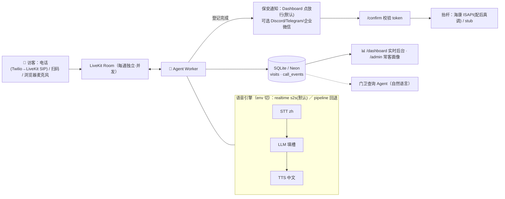

# 🐳 园区语音访客登记 Voice Agent

> 📚 **所有文档索引见 [DOCS.md](DOCS.md)**；🧭 **你要做的账号/操作 + 给本地 CC 的 prompt 看 [SETUP_GUIDE.md](SETUP_GUIDE.md)**；电话接入看 [TELEPHONY.md](TELEPHONY.md)。

未登记车辆**拨打入口号码**（或扫码/浏览器）→ AI 门卫**自然中文对话**采集（车牌/单位/手机/事由）→ 推送保安（Dashboard/微信/Telegram）→ 保安确认 → 抬杆。**Agent 开口到推送 ≤25 秒**。默认 **realtime 语音**（首句 ≈1.4s）。电话接入见 [TELEPHONY.md](TELEPHONY.md)。

## 架构



选型：**LiveKit Agents**（原生 SIP/打断/并发）+ **realtime speech-to-speech**（默认，提速）/ STT→LLM→TTS pipeline（可回退）；全 OpenAI 单 key，全部 env 可切。**每个决策的理由+优势+根因+是否跟模型相关见 [ARCHITECTURE_DECISIONS.md](ARCHITECTURE_DECISIONS.md)**；另见 [FRAMEWORK_RESEARCH.md](FRAMEWORK_RESEARCH.md)、[ARCHITECTURE_AB.md](ARCHITECTURE_AB.md)、[DESIGN.md](DESIGN.md)。

## 部署（本地 demo，约 5 分钟）

```bash
python -m venv .venv && source .venv/bin/activate && pip install -r requirements.txt
cp .env.example .env && mkdir -p data        # 填 OPENAI_API_KEY（唯一必填密钥）
PYTHONPATH=src python -m visitor_agent.agent download-files   # 预下载 VAD/转向模型
docker run -d --name livekit-dev -p 7880:7880 -p 7881:7881 -p 7882:7882/udp \
  livekit/livekit-server --dev               # 本地 LiveKit（devkey/secret，无需账号）

./scripts/run_web.sh        # 终端A → /voice 说话页 · /dashboard 后台 · /ask 数据助手(对话式) · /admin 常客
./scripts/run_agent.sh dev  # 终端B → 语音 worker
# 打开 http://localhost:8080/voice 点"接入门卫"对话；后台点"✅放行"
```

> **Windows / ARM64 / 无 Docker**：ARM64 须用 **x64 Python**（`livekit-blingfire` 无 win_arm64 wheel，x64 模拟可跑）；LiveKit 用原生二进制 `livekit-server.exe --dev` 或直接 **LiveKit Cloud**。详见 [SMOKE_CHECK.md](SMOKE_CHECK.md) §C5（PowerShell 命令对照）。
> **产品升级路线**（操作体验 / 模型效率成本 / 多租户产品化）见 [UPGRADE_PLAN.md](UPGRADE_PLAN.md)。
> **☎️ 拨号进来（核心需求）**：用 LiveKit Cloud + Twilio SIP，`SIP_INBOUND_NUMBER=+1... ./scripts/setup_sip.sh` 建好入站规则即可拨打——全程见 [TELEPHONY.md](TELEPHONY.md)。

无语音快速验证：`./scripts/run_sim.sh --scenario scenarios/songhuo.json --live`（文本仿真，同一套逻辑）。
测试：`PYTHONPATH=src pytest -q`。电话/扫码/教程：[SETUP_CHECKLIST.md](SETUP_CHECKLIST.md) · [QR_DEMO.md](QR_DEMO.md) · [ACCEPTANCE_PROMPT.md](ACCEPTANCE_PROMPT.md)（一键验收）· [USER_TODO.md](USER_TODO.md)（密钥教程）。

## 环境变量（`.env`，已 gitignore，密钥永不上传）

| 变量 | 默认/说明 |
|---|---|
| `OPENAI_API_KEY` | **唯一必填**（STT+LLM+TTS / realtime 全 OpenAI） |
| `VOICE_MODE` | `realtime`(默认 s2s 提速，需 gpt-realtime 权限) / `pipeline`(回退) |
| `SIP_INBOUND_NUMBER` | 电话接入号码（E.164）；配合 `scripts/setup_sip.sh`，见 TELEPHONY.md |
| `ROSTER_PATH` `ACCESS_LIST_PATH` | 公司名单纠正 / 黑白名单（留空=关）；见 `*.example.json` |
| `LLM_PROVIDER` `LLM_MODEL` | `openai`/`gpt-4o-mini`；可切 `anthropic`/`claude-haiku-4-5`（需 `ANTHROPIC_API_KEY`） |
| `STT_*` `TTS_*` | `openai` 默认；可切 `deepgram` / `azure`(zh-CN 音色) |
| `LIVEKIT_URL/API_KEY/API_SECRET` | 本地 dev：`ws://localhost:7880`/`devkey`/`secret`；云：LiveKit Cloud 免费版 |
| `NOTIFY_CHANNEL` | `none`(后台点放行，默认) / `discord` / `telegram` / `wecom` |
| `DATABASE_URL` | `sqlite:///./data/visits.db`；生产换 Neon Postgres URL |
| `PUBLIC_BASE_URL` `WEB_PORT` `TIMEZONE` | `http://localhost:8080` / `8080` / `Asia/Shanghai` |
| `HIKVISION_URL/USER/PASSWORD/CHANNEL` | 留空=抬杆 stub；配上=真实海康 ISAPI |

公共仓库使用：他人 `clone → cp .env.example .env → 填自己的 key` 即可，互不影响。
加分项：回访识别(车牌/手机/姓名画像)✅ · **门卫数据助手 `/ask`（对话式·多轮追问·LLM 工具查询）✅** · 常客名单 `/admin`✅ · 多路并发✅ · 黑白名单(登记不放行)✅ · 放行后 AI 语音播报✅ · Serverless 分层(见 DESIGN)。
变更日志 [CHANGELOG.md](CHANGELOG.md) · 进度 [PROGRESS.md](PROGRESS.md) · 首跑排查 [SMOKE_CHECK.md](SMOKE_CHECK.md)
