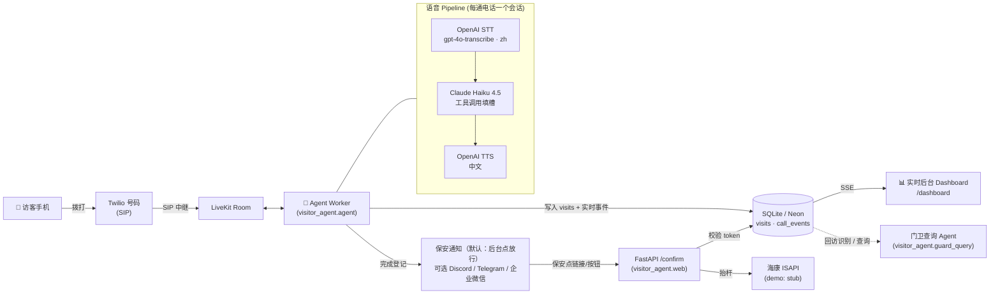

# 🐳 Visitor Voice Agent · 园区语音访客登记

未登记车辆拨打园区入口电话 → AI 门卫用**自然中文对话**采集（车牌 / 来访单位 / 手机号 / 事由）→ 结构化信息推送到**保安企业微信** → 保安点链接确认 → （海康抬杆，demo 为 stub）。从 Agent 开口到微信发出 **≤ 25 秒**。

> **一键验收**：你只需准备**一个** `OPENAI_API_KEY`（见 **[USER_TODO.md](USER_TODO.md)** 手把手教程），把 **[ACCEPTANCE_PROMPT.md](ACCEPTANCE_PROMPT.md)** 整段喂给本地 Claude Code，其余（本地 LiveKit、起服务）全自动；然后开 `localhost:8080/voice` 对着麦克风说话、在 `localhost:8080/dashboard` 点"放行"。**无需注册 LiveKit/Discord 等任何账号。** 手机扫码版见 **[QR_DEMO.md](QR_DEMO.md)**。
> 选型理由、延迟预算、中国落地路径见 **[DESIGN.md](DESIGN.md)**；逐步部署见 **[SETUP_CHECKLIST.md](SETUP_CHECKLIST.md)**。

## 架构



**v1 选型**：编排 = LiveKit Agents（原生 SIP / 打断 / 并发）；STT/LLM/TTS 全部 env 可切换；保安通知 = 可插拔（demo 默认 **Discord**，可选 Telegram，生产 企业微信）；抬杆 = stub。
**访客接入三形态**：① 浏览器麦克风 `/voice`（下载即用，无需电话）② 扫码 `/qr`（入口贴码，手机扫即用）③ 电话拨打（Twilio SIP，精修中）。

## 部署（本地 demo）

```bash
# 1. 装依赖
python -m venv .venv && source .venv/bin/activate
pip install -r requirements.txt

# 2. 配置
cp .env.example .env        # 填入 OpenAI / Anthropic 密钥、企微 webhook、Twilio/LiveKit
mkdir -p data

# 3a. 起 Web 服务：语音页 + 二维码 + 后台 + 确认端点
./scripts/run_web.sh
#   http://localhost:8080/voice      访客对着麦克风说话（无需电话）
#   http://localhost:8080/qr         入口二维码（手机扫即用）
#   http://localhost:8080/dashboard  保安实时后台

# 3b. 起语音 Agent worker（首次先 download-files 拉模型）
PYTHONPATH=src python -m visitor_agent.agent download-files
./scripts/run_agent.sh dev               # 连 LiveKit，等待接入

# 4. 打开 /voice 点"接入门卫"对话；电话(Twilio SIP)接入见 SETUP_CHECKLIST.md（精修）
```

**无需电话即可验证对话逻辑（只需 Anthropic 密钥）：**
```bash
./scripts/run_sim.sh --scenario scenarios/songhuo.json   # 脚本化
./scripts/run_sim.sh                                      # 交互式
```

**跑测试 / 加分功能：**
```bash
PYTHONPATH=src pytest -q                                  # 16 个单测
python -m visitor_agent.guard_query "本周一共多少访问车辆？"   # 门卫查询 Agent
```

## 环境变量

| 变量 | 说明 |
|---|---|
| `LLM_PROVIDER` / `LLM_MODEL` | `openai` / `gpt-4o-mini`（默认，一个 key 跑通；可切 `anthropic`/`claude-haiku-4-5`） |
| `ANTHROPIC_API_KEY` | 仅当 `LLM_PROVIDER=anthropic` 时需要（可选升级） |
| `STT_PROVIDER` / `STT_MODEL` / `STT_LANGUAGE` | `openai` / `gpt-4o-transcribe` / `zh` |
| `TTS_PROVIDER` / `TTS_MODEL` / `TTS_VOICE` | `openai` / `gpt-4o-mini-tts` / `alloy` |
| `OPENAI_API_KEY` | OpenAI 密钥（STT + TTS） |
| `NOTIFY_CHANNEL` | `none`(默认，后台点放行) / `discord` / `telegram` / `wecom` |
| `DISCORD_WEBHOOK_URL` | Discord 频道 webhook（可选外部推送） |
| `TELEGRAM_BOT_TOKEN` / `TELEGRAM_CHAT_ID` | Telegram 通知（带确认按钮） |
| `WECOM_WEBHOOK_URL` | 企业微信群机器人（生产渠道） |
| `PUBLIC_BASE_URL` | 确认服务公网地址（保安链接用） |
| `DATABASE_URL` | `sqlite:///./data/visits.db`（云上换 Neon Postgres URL 即可） |
| `LIVEKIT_URL` / `LIVEKIT_API_KEY` / `LIVEKIT_API_SECRET` | LiveKit 凭据 |
| `TIMEZONE` / `WEB_PORT` | `Asia/Shanghai` / `8080` |

## 🔐 密钥与配置（public 仓库必读）

**密钥存哪？** 全部放在项目根目录的 **`.env`** 文件里。`.env` 已被 `.gitignore` 忽略，**永远不会被提交/上传**，所以即使仓库是 public，你的密钥也只在你本机。仓库里只有 **`.env.example`**（模板，全是占位符/空值，**不含任何真实密钥**）。

**别人想用这个 public demo、换成他们自己的密钥怎么操作？**
```bash
git clone <repo>          # 或 Fork
cp .env.example .env      # 生成自己的本地配置（不会被提交）
# 编辑 .env，填入“他们自己的” ANTHROPIC_API_KEY / OPENAI_API_KEY
pip install -r requirements.txt
# 按 ACCEPTANCE_PROMPT.md 跑起来
```
> 任何人都是"clone → 复制 .env.example 为 .env → 填自己的 key"。你的密钥不会出现在他们那里，他们的也不会回流到仓库。**铁律：永远不要把 `.env` 提交上去**（已被忽略，正常操作不会误传）。

**要几个 API key？**
| 方案 | 需要的 key | 怎么配 |
|---|---|---|
| **默认（Claude 大脑 + OpenAI 语音）** | `ANTHROPIC_API_KEY` + `OPENAI_API_KEY` | `.env` 默认即是 |
| **只用一个 key（全 OpenAI）** | 仅 `OPENAI_API_KEY` | `.env` 设 `LLM_PROVIDER=openai`、`LLM_MODEL=gpt-4o-mini` |

> 两个 key 不是两个 LLM：**Claude 管对话/填槽，OpenAI 管 STT(听)+TTS(说)**。想省一个 key 就让 OpenAI 同时当大脑。
> `LIVEKIT_API_KEY=devkey` / `LIVEKIT_API_SECRET=secret` 是本地 `livekit-server --dev` 的**公开默认值，不是机密**，可放心写在配置里。

## 目录

```
src/visitor_agent/
  agent.py          LiveKit worker（电话入口）       providers.py   STT/LLM/TTS 装配（env 切换）
  prompts.py        中文门卫 system prompt           slots.py       槽位模型 + 规范化
  session_logic.py  登记大脑（record/complete，live & sim 共用）
  notify/           dispatch + discord/telegram/wecom 渠道  notify/gate.py  抬杆 stub（含 ISAPI）
  db/               visits + call_events 模型/仓储  web/server.py  /voice /qr /dashboard /confirm /guard/query
  guard_query.py    门卫查询 Agent（加分）           sim/run_text.py 离线文本仿真
tests/              16 个离线单测                    scenarios/     仿真脚本
```

加分项状态：**回访识别 ✅** · **门卫查询 Agent ✅** · **多路并发 ✅（每通电话独立 job，无共享状态）** · **Serverless ⚠️ 分层可达（见 DESIGN.md）**。
