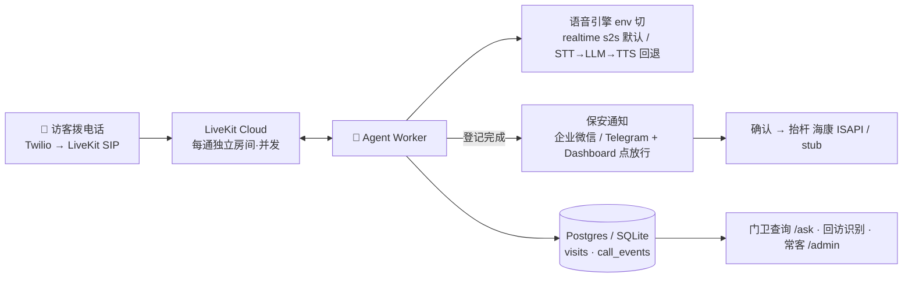

# 🐳 园区语音访客登记 Voice Agent

未登记车辆拨打入口电话 → AI 门卫**自然中文对话**采集（车牌 / 单位 / 手机 / 事由）→ 结构化信息推送保安微信 → 保安点确认远程放行。**Agent 开口到推送 ≤25 秒**，默认 realtime 语音到语音（首句 ≈1.4s）。

> 📞 **在线试拨**：**+1 586 325 7270** ｜ 🌐 后台 https://web-production-d105c.up.railway.app （`/dashboard` 实时后台 · `/ask` 数据助手 · `/admin` 常客，门卫口令 `demo123`）
> 📖 **详细操作 / 部署 / 排错 → [GUIDE.md](GUIDE.md)**；全部文档索引 → [DOCS.md](DOCS.md)。

## 架构



**选型**：LiveKit Agents（原生 SIP / 打断 / 并发）+ OpenAI realtime speech-to-speech（默认，提速）/ STT→LLM→TTS pipeline（可回退、可换任意模型，全 env 切换）。完整理由见 [ARCHITECTURE_DECISIONS.md](ARCHITECTURE_DECISIONS.md) · [FRAMEWORK_RESEARCH.md](FRAMEWORK_RESEARCH.md)。

## 部署（本地 demo，约 5 分钟）

```bash
python -m venv .venv && source .venv/bin/activate && pip install -r requirements.txt
cp .env.example .env && mkdir -p data          # 填 OPENAI_API_KEY（唯一必填密钥）
docker run -d -p 7880:7880 -p 7881:7881 -p 7882:7882/udp livekit/livekit-server --dev
./scripts/run_web.sh         # 终端A → :8080  /dashboard · /ask · /admin
./scripts/run_agent.sh dev   # 终端B → 语音 worker
# 无麦克风/电话的文本仿真：./scripts/run_sim.sh --scenario scenarios/songhuo.json --live
```

> **Windows / ARM64**、**电话接入（Twilio SIP）**、**全云端常驻（Railway + LiveKit Cloud + Postgres，push 自动上线）** 的完整步骤都在 **[GUIDE.md](GUIDE.md)**。

## 环境变量（`.env`，已 gitignore，密钥永不上传）

| 变量 | 默认 / 说明 |
|---|---|
| `OPENAI_API_KEY` | **唯一必填**（STT + LLM + TTS / realtime 全 OpenAI） |
| `VOICE_MODE` | `realtime`(默认 s2s 提速) / `pipeline`(回退，可换任意模型) |
| `LIVEKIT_URL` `API_KEY` `API_SECRET` | 本地 dev `ws://localhost:7880` / `devkey` / `secret`；电话接入需 LiveKit Cloud |
| `NOTIFY_CHANNEL` | `none`(后台点放行) / `wecom`(企业微信群机器人,已上线) / `telegram` / `pushplus` / `discord`，逗号可多选 |
| `DATABASE_URL` | `sqlite:///./data/visits.db`；生产换 Postgres |
| `SIP_INBOUND_NUMBER` `GUARD_PHONES` | 入园电话号码 / 门卫查询手机白名单 |

> 完整变量（realtime 抗噪音调参、roster 名单匹配、黑白名单、海康抬杆、多租户等）见 [.env.example](.env.example) 与 [GUIDE.md](GUIDE.md)。

## 加分项（均已实现）

回访识别 ✅ · 门卫数据助手 `/ask`（对话式 · 多轮追问 · LLM 工具查询）✅ · 常客名单 `/admin` ✅ · 多路并发 ✅ · 黑白名单拦截 ✅ · 放行后 AI 语音播报 ✅ · 全云端 Serverless 部署 + GitHub 自动上线 ✅

测试：`PYTHONPATH=src pytest -q` → **94 passed**。
