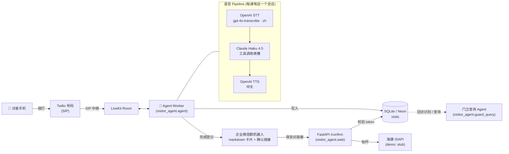

# 🐳 Visitor Voice Agent · 园区语音访客登记

未登记车辆拨打园区入口电话 → AI 门卫用**自然中文对话**采集（车牌 / 来访单位 / 手机号 / 事由）→ 结构化信息推送到**保安企业微信** → 保安点链接确认 → （海康抬杆，demo 为 stub）。从 Agent 开口到微信发出 **≤ 25 秒**。

> 选型理由、延迟预算、中国落地路径见 **[DESIGN.md](DESIGN.md)**。动手部署见 **[SETUP_CHECKLIST.md](SETUP_CHECKLIST.md)**。

## 架构



**v1 选型**：编排 = LiveKit Agents（原生 SIP / 打断 / 并发）；电话 = Twilio；STT/LLM/TTS 全部 env 可切换；微信 = 企微群机器人 Webhook；抬杆 = stub。

## 部署（本地 demo）

```bash
# 1. 装依赖
python -m venv .venv && source .venv/bin/activate
pip install -r requirements.txt

# 2. 配置
cp .env.example .env        # 填入 OpenAI / Anthropic 密钥、企微 webhook、Twilio/LiveKit
mkdir -p data

# 3a. 起 Web 确认服务（保安点链接的落点）
./scripts/run_web.sh                     # :8080 ；公网用 ngrok/cloudflared 映射并填回 PUBLIC_BASE_URL

# 3b. 起语音 Agent worker
./scripts/run_agent.sh dev               # 连 LiveKit，等待来电

# 4. 把 Twilio 号码的 SIP 接到 LiveKit（见 SETUP_CHECKLIST.md），用手机拨打测试
```

**无需电话即可验证对话逻辑（只需 Anthropic 密钥）：**
```bash
./scripts/run_sim.sh --scenario scenarios/songhuo.json   # 脚本化
./scripts/run_sim.sh                                      # 交互式
```

**跑测试 / 加分功能：**
```bash
PYTHONPATH=src pytest -q                                  # 16 个单测
python -m visitor_agent.guard_query "本周一共多少访问车辆？"   # 门卫查询 Agent
```

## 环境变量

| 变量 | 说明 |
|---|---|
| `LLM_PROVIDER` / `LLM_MODEL` | `anthropic` / `claude-haiku-4-5`（可切 openai） |
| `ANTHROPIC_API_KEY` | Claude 密钥（LLM + 门卫查询 Agent） |
| `STT_PROVIDER` / `STT_MODEL` / `STT_LANGUAGE` | `openai` / `gpt-4o-transcribe` / `zh` |
| `TTS_PROVIDER` / `TTS_MODEL` / `TTS_VOICE` | `openai` / `gpt-4o-mini-tts` / `alloy` |
| `OPENAI_API_KEY` | OpenAI 密钥（STT + TTS） |
| `WECOM_WEBHOOK_URL` | 企业微信群机器人 webhook |
| `PUBLIC_BASE_URL` | 确认服务公网地址（保安链接用） |
| `DATABASE_URL` | `sqlite:///./data/visits.db`（云上换 Neon Postgres URL 即可） |
| `LIVEKIT_URL` / `LIVEKIT_API_KEY` / `LIVEKIT_API_SECRET` | LiveKit 凭据 |
| `TIMEZONE` / `WEB_PORT` | `Asia/Shanghai` / `8080` |

## 目录

```
src/visitor_agent/
  agent.py          LiveKit worker（电话入口）       providers.py   STT/LLM/TTS 装配（env 切换）
  prompts.py        中文门卫 system prompt           slots.py       槽位模型 + 规范化
  session_logic.py  登记大脑（record/complete，live & sim 共用）
  notify/wecom.py   企微推送         notify/gate.py  抬杆 stub（含 ISAPI 真实形态）
  db/               visits 模型 + 仓储（回访/查询）  web/server.py  /confirm + /guard/query
  guard_query.py    门卫查询 Agent（加分）           sim/run_text.py 离线文本仿真
tests/              16 个离线单测                    scenarios/     仿真脚本
```

加分项状态：**回访识别 ✅** · **门卫查询 Agent ✅** · **多路并发 ✅（每通电话独立 job，无共享状态）** · **Serverless ⚠️ 分层可达（见 DESIGN.md）**。
