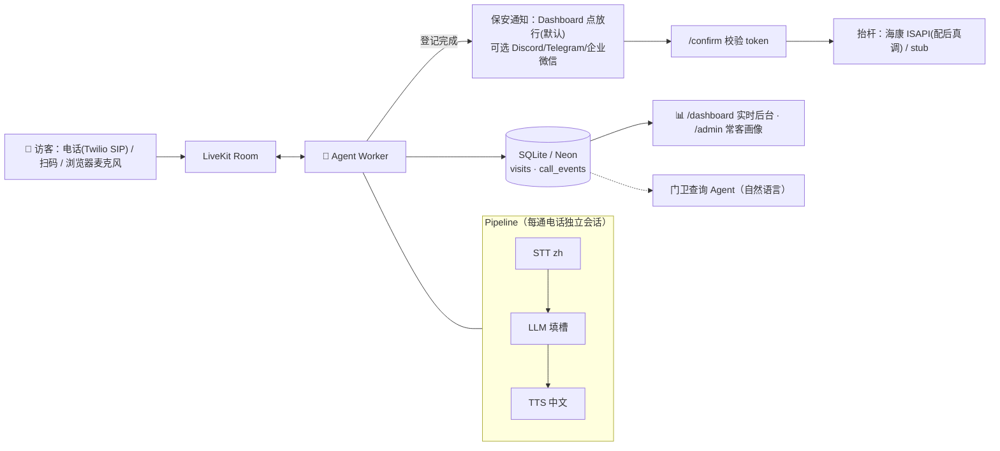

# 🐳 园区语音访客登记 Voice Agent

> 📚 **所有文档的索引见 [DOCS.md](DOCS.md)**；产品全流程+双视角看 [PRODUCT_FLOW.md](PRODUCT_FLOW.md)；框架调研看 [FRAMEWORK_RESEARCH.md](FRAMEWORK_RESEARCH.md)。

未登记车辆呼入 → AI 门卫**自然中文对话**采集（车牌/单位/手机/事由）→ 推送保安（Dashboard/微信/Discord）→ 保安确认 → 抬杆。**Agent 开口到推送 ≤25 秒**。

## 架构



选型：**LiveKit Agents**（原生 SIP/打断/并发）+ **STT→LLM→TTS pipeline**（默认全 OpenAI，单 key；全部 env 可切）。理由与对比见 [DESIGN.md](DESIGN.md)、[FRAMEWORK_RESEARCH.md](FRAMEWORK_RESEARCH.md)。

## 部署（本地 demo，约 5 分钟）

```bash
python -m venv .venv && source .venv/bin/activate && pip install -r requirements.txt
cp .env.example .env && mkdir -p data        # 填 OPENAI_API_KEY（唯一必填密钥）
PYTHONPATH=src python -m visitor_agent.agent download-files   # 预下载 VAD/转向模型
docker run -d --name livekit-dev -p 7880:7880 -p 7881:7881 -p 7882:7882/udp \
  livekit/livekit-server --dev               # 本地 LiveKit（devkey/secret，无需账号）

./scripts/run_web.sh        # 终端A → /voice 说话页 · /dashboard 后台 · /admin 常客
./scripts/run_agent.sh dev  # 终端B → 语音 worker
# 打开 http://localhost:8080/voice 点"接入门卫"对话；后台点"✅放行"
```

> **Windows / ARM64 / 无 Docker**：见 [SMOKE_CHECK.md](SMOKE_CHECK.md) §C5（用 x64 Python + LiveKit 原生二进制 + PowerShell 命令对照）。

无语音快速验证：`./scripts/run_sim.sh --scenario scenarios/songhuo.json --live`（文本仿真，同一套逻辑）。
测试：`PYTHONPATH=src pytest -q`。电话/扫码/教程：[SETUP_CHECKLIST.md](SETUP_CHECKLIST.md) · [QR_DEMO.md](QR_DEMO.md) · [ACCEPTANCE_PROMPT.md](ACCEPTANCE_PROMPT.md)（一键验收）· [USER_TODO.md](USER_TODO.md)（密钥教程）。

## 环境变量（`.env`，已 gitignore，密钥永不上传）

| 变量 | 默认/说明 |
|---|---|
| `OPENAI_API_KEY` | **唯一必填**（STT+LLM+TTS 全 OpenAI） |
| `LLM_PROVIDER` `LLM_MODEL` | `openai`/`gpt-4o-mini`；可切 `anthropic`/`claude-haiku-4-5`（需 `ANTHROPIC_API_KEY`） |
| `STT_*` `TTS_*` | `openai` 默认；可切 `deepgram` / `azure`(zh-CN 音色) |
| `LIVEKIT_URL/API_KEY/API_SECRET` | 本地 dev：`ws://localhost:7880`/`devkey`/`secret`；云：LiveKit Cloud 免费版 |
| `NOTIFY_CHANNEL` | `none`(后台点放行，默认) / `discord` / `telegram` / `wecom` |
| `DATABASE_URL` | `sqlite:///./data/visits.db`；生产换 Neon Postgres URL |
| `PUBLIC_BASE_URL` `WEB_PORT` `TIMEZONE` | `http://localhost:8080` / `8080` / `Asia/Shanghai` |
| `HIKVISION_URL/USER/PASSWORD/CHANNEL` | 留空=抬杆 stub；配上=真实海康 ISAPI |

公共仓库使用：他人 `clone → cp .env.example .env → 填自己的 key` 即可，互不影响。
加分项：回访识别(车牌/手机/姓名画像)✅ · 门卫查询 Agent✅ · 常客名单 `/admin`✅ · 多路并发✅ · Serverless 分层(见 DESIGN)。
变更日志 [CHANGELOG.md](CHANGELOG.md) · 进度 [PROGRESS.md](PROGRESS.md) · 首跑排查 [SMOKE_CHECK.md](SMOKE_CHECK.md)
